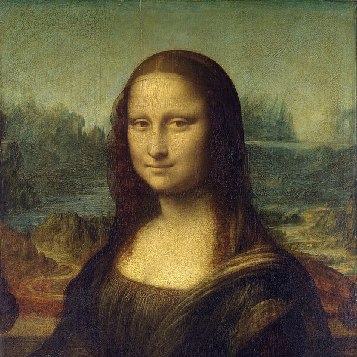
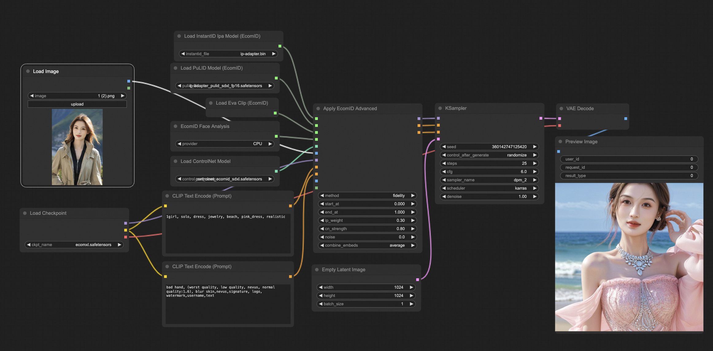
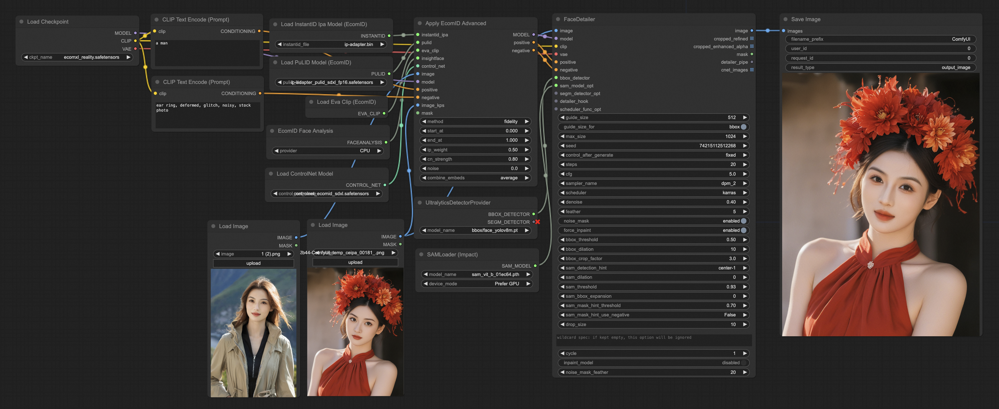
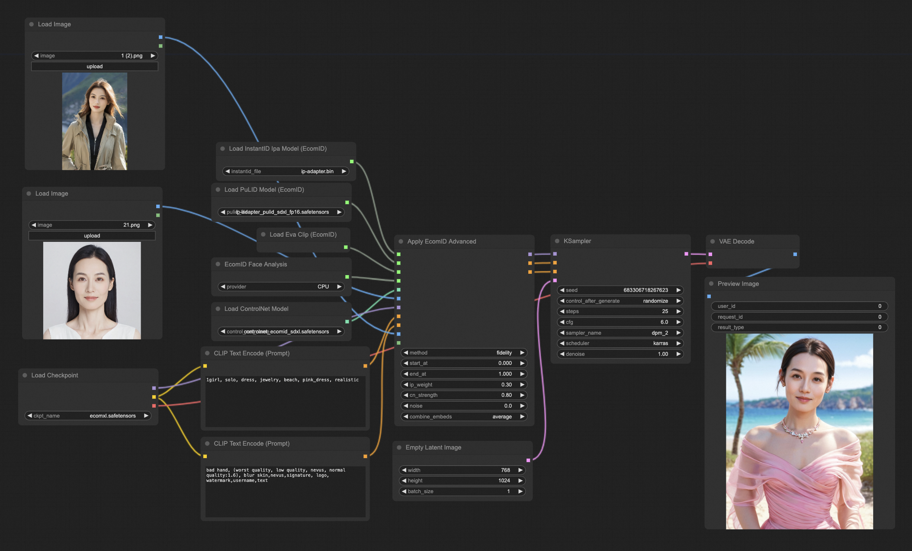
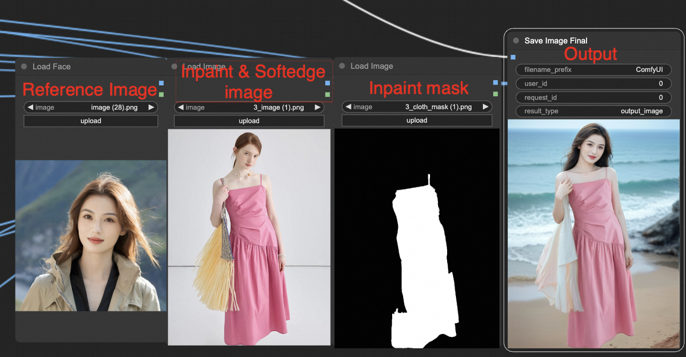

  
  

# ComfyUI EcomID (Native Support)

Native [SDXL-EcomID](https://huggingface.co/alimama-creative/SDXL-EcomID) support for [ComfyUI](https://github.com/comfyanonymous/ComfyUI).

This extension doesn't use *diffusers* but instead implements EcomID natively and it fully integrates with ComfyUI.

## Show Cases
EcomID enhances portrait representation, delivering a more authentic and aesthetically pleasing appearance while ensuring semantic consistency and greater internal ID similarity (i.e., traits that do not vary with age, hairstyle, glasses, or other physical changes).

<table>
    <tr>
        <th style="width: 24%;">Prompt</th>
        <th style="width: 19%;">Reference Image</th>
        <th style="width: 19%;">EcomID</th>
        <th style="width: 19%;">InstantID</th>
        <th style="width: 19%;">PuLID</th>
    </tr>
    <tr>
        <td style="font-size: 12px;">A close-up portrait of a <strong>little girl with double braids</strong>, wearing a white dress, standing on the beach during sunset.</td>
        <td></td>
        <td></td>
        <td></td>
        <td></td>
    </tr>
    <tr>
        <td style="font-size: 12px;">A close-up portrait of a <strong>very little girl</strong> with double braids, wearing <strong>a hat</strong> and white dress, standing on the beach during sunset.</td>
        <td></td>
        <td></td>
        <td></td>
        <td></td>
    </tr>
    <tr>
        <td style="font-size: 12px;">Agrizzled detective, <strong>fedora</strong> casting a shadow over his square jaw, a <strong>cigar dangling from his lips</strong>, his trench coat evocative of film noir, in a <strong>rainy alley</strong>.</td>
        <td></td>
        <td></td>
        <td></td>
        <td></td>
    </tr>
    <tr>
        <td style="font-size: 12px;">A smiling girl with <strong>bangs and long hair</strong> in a school uniform stands under cherry trees, holding a book.</td>
        <td></td>
        <td></td>
        <td></td>
        <td></td>
    </tr>
    <tr>
        <td style="font-size: 12px;">A <strong>very old</strong> witch, wearing a black cloak, with a pointed hat, holding a magic wand, against a background of a misty forest.</td>
        <td></td>
        <td></td>
        <td></td>
        <td></td>
    </tr>
    <tr>
        <td style="font-size: 12px;">A man clad in cyberpunk fashion: <strong>neon accents, reflective sunglasses，</strong> and a leather jacket with glowing circuit patterns. He stands stoically amidst a soaked cityscape.</td>
        <td></td>
        <td></td>
        <td></td>
        <td></td>
    </tr>

</table>

You can see more showcases in the [SDXL-EcomID](https://huggingface.co/alimama-creative/SDXL-EcomID) repository.

## Basic Workflow

In the `examples` directory, you'll find both the basic workflow and the dedicated face-swapping workflow.

## Installation

**Upgrade ComfyUI to the latest version!**

Download or `git clone` this repository into the `ComfyUI/custom_nodes/` directory or use the Manager.

EcomID requires `insightface`, you need to add it to your libraries together with `onnxruntime` and `onnxruntime-gpu`.

Models:
- [PuLID pre-trained model](https://huggingface.co/huchenlei/ipadapter_pulid/resolve/main/ip-adapter_pulid_sdxl_fp16.safetensors?download=true) goes in `ComfyUI/models/pulid/` (thanks to [Chenlei Hu](https://github.com/huchenlei) for converting them into IPAdapter format)
- The **EVA CLIP** is EVA02-CLIP-L-14-336, but should be downloaded automatically (will be located in the huggingface directory).
- `facexlib` dependency needs to be installed, the models are downloaded at first use
- You also need **InsightFace** with [AntelopeV2](https://huggingface.co/MonsterMMORPG/tools/tree/main), the unzipped models should be placed in `ComfyUI/models/insightface/models/antelopev2`
- The **ip_adapter model of InstantID** can be downloaded from [HuggingFace](https://huggingface.co/InstantX/InstantID/resolve/main/ip-adapter.bin?download=true) and should be placed into the `ComfyUI/models/instantid` directory. (Note that the model is called *ip_adapter* as it is based on the [IPAdapter](https://github.com/tencent-ailab/IP-Adapter)).
- You also needs a **[ControlNet](https://huggingface.co/alimama-creative/SDXL-EcomID/resolve/main/diffusion_pytorch_model.safetensors?download=true)** trained on 2M real human images. Please place it in the ComfyUI controlnet directory.

## Various Resolutions

Feel free to generate images in various resolutions, as we have trained the controlnet on 2 million high-quality images.
## Normal CFG

You can set a higher CFG value to achieve even better semantic consistency. Values from 1 to 7 are acceptable, with 6 being recommended.

## Face keypoints

The pose of the person is aligned with the keypoints generated from the reference image, just like in InstantID. You can achieve a different pose by sending an image to the **image_kps** input.

## Advanced Node

There's an EcomID advanced node available, at the moment the only difference with the standard one is that you can set the weights for the ip-adapter (PulID) models and the controlnet separately. 

## Other notes

- Referenced the following repositories: [ComfyUI_InstantID](https://github.com/cubiq/ComfyUI_InstantID) and [PuLID_ComfyUI](https://github.com/cubiq/PuLID_ComfyUI).

- Remember at the moment this is only compatible with SDXL-based models, such as EcomXL, [leosams-helloworld-xl](https://civitai.com/models/43977/leosams-helloworld-xl), [dreamshaper-xl](https://civitai.com/models/112902/dreamshaper-xl), [stable-diffusion-xl-base-1.0](https://huggingface.co/stabilityai/stable-diffusion-xl-base-1.0) and so on.
- It works very well with SDXL Turbo/Lighting, [EcomXL-Inpainting-ControlNet](https://huggingface.co/alimama-creative/EcomXL_controlnet_inpaint) and [EcomXL-Softedge-ControlNet](https://huggingface.co/alimama-creative/EcomXL_controlnet_softedge).

The results of the Multi-ControlNet are shown below:

